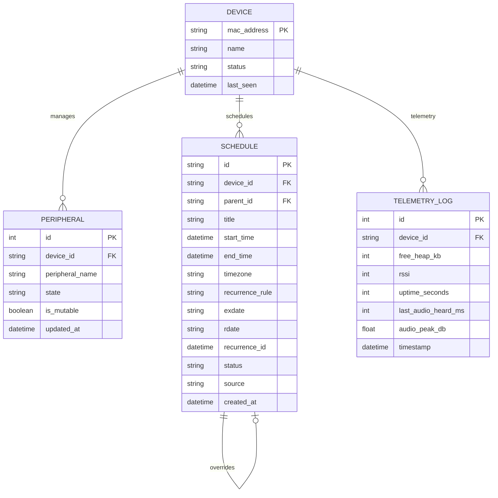
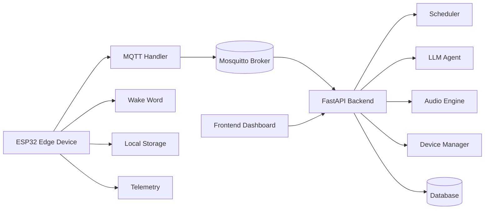
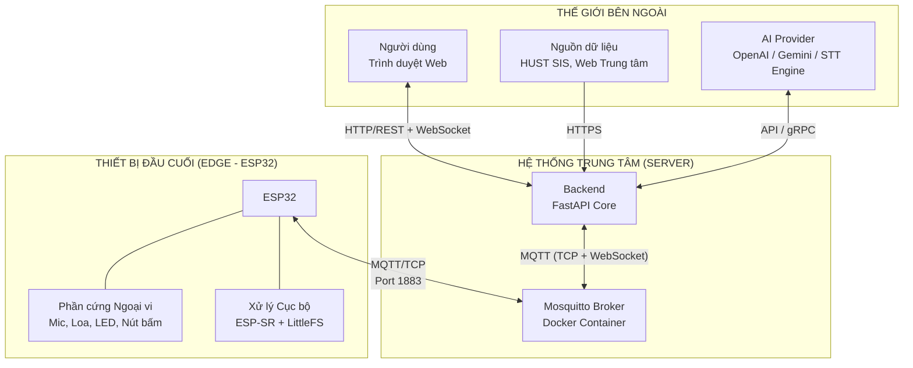

# Kiến trúc Tổng thể Hệ thống IoT Schedule

## Tổng quan

Bản đặc tả kiến trúc tổng thể (*System Architecture*) cho hệ thống IoT Schedule.

Kiến trúc được thiết kế theo mô hình **Layered Architecture**, tách biệt rõ ràng giữa:

* Phần cứng
* Giao tiếp
* Xử lý logic
* Giao diện người dùng

---

# 1. Lớp Edge (Thiết bị đầu cuối - ESP32)

Đóng vai trò là **"Giác quan"** và **"Người thực thi"** tại chỗ.

Hệ thống hoạt động trên:

* FreeRTOS
* ESP-IDF Framework

## 1.1. Audio Subsystem (I2S)

Quản lý luồng âm thanh:

* Input: Microphone
* Output: Speaker/Buzzer

---

## 1.2. Edge AI Engine (ESP-SR)

### WakeNet

Liên tục lắng nghe offline để phát hiện từ khóa đánh thức.

Ví dụ:

```text
"Hey System"
```

### MultiNet

* MultiNet sử dụng model có sẵn từ ESP-SR.
* Ví dụ tiếng Việt trong tài liệu chỉ mang tính minh họa luồng xử lý.
* Hệ thống ưu tiên tiếng Anh để giảm độ phức tạp khi triển khai offline
  
Ví dụ:

```text
"Stop"
"Snooze 10 minutes"
```

Các lệnh này được xử lý cục bộ mà không cần gửi lên Server.

---

## 1.3. Local Storage (LittleFS)

Bộ nhớ đệm lưu trữ:

* Danh sách lịch trình
* JSON rút gọn
* Dữ liệu cho 24 - 48 giờ tới

Mục tiêu:

* ESP32 vẫn báo thức đúng giờ ngay cả khi mất kết nối mạng.


### ACK xác nhận ghi dữ liệu

Sau khi ESP32 ghi thành công dữ liệu lịch trình xuống LittleFS:

* ESP32 sẽ publish ACK xác nhận lên MQTT.
* ACK giúp Server biết dữ liệu đã thực sự được lưu xuống flash.
* ACK này độc lập với ACK của MQTT QoS.

Lý do không chỉ sử dụng QoS 2:

* QoS 2 chỉ đảm bảo bản tin MQTT được nhận đúng một lần.
* QoS 2 không đảm bảo dữ liệu đã được ghi thành công vào LittleFS.
* ACK ứng dụng giúp xác nhận toàn bộ pipeline:

```text
Broker nhận bản tin
    ↓
ESP32 parse JSON
    ↓
ESP32 ghi LittleFS thành công
    ↓
ESP32 publish ACK
```
---

## 1.4. Device Shadow & Telemetry

### Chức năng

* Thu thập trạng thái thiết bị ngoại vi (Device Shadow):

  * Mic
  * Loa
  * LED
  * Nút bấm
  * ...
* Hardware Telemetry & Audio Monitor: Định kỳ (ví dụ: 5 phút/lần) đo đạc thông số sức khỏe của mạch
  * RAM trống
  * Cường độ sóng WiFi RSSI
  * Thời gian hoạt động Uptime
* Giám sát Âm thanh (Audio Heard): Tính năng này sẽ đo data từ Mic I2S để đẩy về Server, giúp phát hiện sớm tình trạng nhiễu phần cứng hoặc hỏng hóc micro từ xa.:
  *  độ dài đoạn âm thanh thu được gần nhất (last_audio_heard_ms)
  *  cường độ đỉnh âm thanh (audio_peak_db) 
* Đóng gói dữ liệu thành JSON
* Gửi trạng thái lên Server

### MQTT Responsibilities

* Quản lý kết nối MQTT
* Duy trì cờ LWT (*Last Will and Testament*)
* Giúp Server phát hiện thiết bị mất kết nối đột ngột

## 1.5. Kênh Truyền Tải Bền Vững (Persistent Session)
- Cấu hình MQTT Client trên ESP32 với cờ Clean Session = False (hoặc Clean Start = False ở v5).

- Mục tiêu: Khi WiFi chập chờn hoặc rớt mạng ngắn hạn, Broker sẽ tự động lưu lại các bản tin điều khiển quan trọng (QoS 1) và đẩy bù cho ESP32 ngay khi thiết bị tái kết nối thành công mà không cần sub lại các topic từ đầu.
---

# 2. Lớp Connectivity (Mosquitto Broker)

Đóng vai trò là:

* Trạm trung chuyển dữ liệu
* Message Broker MQTT

Mosquitto chạy độc lập trong Docker Container.

## 2.1. TCP Port 1883

Kênh truyền thông không mã hóa dành riêng cho ESP32 và Server Core. Đảm bảo băng thông và độ trễ thấp nhất để truyền tải:

* Luồng âm thanh thô (Audio Stream Up/Down).

* Bản tin trạng thái thiết bị ngoại vi (Device Shadow).

* Dữ liệu đồng bộ lịch trình và lệnh điều khiển hệ thống.

### Đánh giá băng thông Audio MQTT

Đây là vấn đề kỹ thuật cần được benchmark thực tế trong quá trình triển khai dự án.

Các yếu tố cần đo đạc:

* Tần số lấy mẫu Audio
* Kích thước chunk MQTT
* Tốc độ WiFi thực tế
* CPU usage của ESP32
* Latency đầu cuối
* Tỷ lệ mất packet

Các bài test sẽ giúp xác định:

* Giới hạn stream ổn định của MQTT
* Có cần nén audio hay không
---

## 2.2. WebSocket Port 9001

Mở cổng WebSocket để cho phép giao diện người dùng (Frontend Web) kết nối trực tiếp vào Broker.

Mục đích:
* Nhận dữ liệu realtime
* Không cần reload trang

Ví dụ dữ liệu:

* Online/Offline state
* Device logs
* Peripheral status

---

# 3. Lớp Backend (FastAPI Core)

Đây là:

* Bộ não trung tâm
* Xử lý tác vụ nặng
* Quản lý dữ liệu toàn cục

---

## 3.1. Device & State Manager

### Chức năng

* Quản lý danh sách thiết bị
* Theo dõi trạng thái Online/Offline
* Lắng nghe topic LWT
* Lưu trạng thái ngoại vi (*Device Shadow*)

---

## 3.2. NLP & Audio Engine

### Speech-to-Text (STT)

* Nhận audio stream từ MQTT
* Nối các mảnh dữ liệu (chunks) va chuyển giọng nói thành văn bản

### LLM Agent

Nhận input từ:

* Voice
* Web UI

Thực hiện:

* Intent detection (CRUD)
* Entity extraction:

  * Thời gian
  * Môn học
  * Quy luật lặp lại
* Chuẩn hóa dữ liệu thành JSON
* Validate bằng Pydantic

---

## 3.3. Data Aggregator (Crawler Services)

Các script crawler chạy nền để thu thập dữ liệu từ:

* HUST SIS
* Website trung tâm tiếng Anh
* Các nguồn lịch học khác

Công nghệ có thể sử dụng:

* Selenium
* BeautifulSoup

### Quy tắc ưu tiên dữ liệu

Trong trường hợp dữ liệu từ Voice Command và Crawler xung đột:

* Hệ thống ưu tiên dữ liệu từ Crawler.
* Thiết kế theo hướng thừa dữ liệu còn hơn thiếu dữ liệu

---

## 3.4. Task Scheduler (APScheduler)

Scheduler chạy định kỳ nền.

### Nhiệm vụ

* Quét Database
* Trích xuất lịch 1 - 2 ngày tiếp theo
* Đóng gói JSON
* Publish xuống topic MQTT của ESP32
* Đồng bộ dữ liệu xuống LittleFS
* Hỗ trợ MQTT v5 Message Expiry: Khi gửi gói lịch trình, Server đính kèm thuộc tính Message Expiry Interval (ví dụ: 3600 giây). Nếu ESP32 offline vượt quá thời gian này, Broker tự động hủy bản tin, ngăn chặn tình trạng thiết bị báo thức dồn dập các lịch cũ khi có mạng trở lại.
* Lắng nghe phản hồi tác vụ Offline (Snooze, Stop) của người dùng từ Edge phát lên để cập nhật lại cơ sở dữ liệu tổng.
### Xử lý phản hồi từ Edge

Nhận lệnh:

* Snooze
* Stop

Sau đó cập nhật lại Database.

---

# 4. Lớp Data & Storage (Database)

Lưu trữ dữ liệu vĩnh viễn (*Persistent Storage*).

## Database Engine

### Development

* SQLite

### Production

* PostgreSQL

### ER diagram


---
## 4.1. Devices Table

Quản lý:

* MAC Address
* Device name
* Online/Offline state

---

## 4.2. Peripherals Table

Lưu trạng thái:

* Mic
* Speaker
* LED
* Peripheral modules

---

## 4.3. Schedules Table

Lưu:

* Khung thời gian biểu chuẩn: Lưu chuỗi sự kiện định kỳ (RRULE) kèm múi giờ (timezone) để xử lý chính xác sai lệch giờ.
* Quản lý ngoại lệ (Exceptions): 
  * Lưu trữ các sự kiện bị hủy (exdate)
  * Sự kiện thêm mới (rdate)
  * Các lịch bị thay đổi/snooze (qua cơ chế tự tham chiếu parent_id và recurrence_id).
* Dữ liệu đã merge từ:

  * Crawler
  * Voice command

---

## 4.4. telemetry_logs Table

Bảng dạng Time-series lưu trữ:
* lịch sử các thông số hệ thống của ESP32 gửi lên (Free RAM, RSSI, Uptime)
* dữ liệu giám sát micro (last_audio_heard_ms, audio_peak_db) 

phục vụ việc vẽ biểu đồ theo dõi sức khỏe thiết bị trên Web Dashboard.


# 5. Lớp Frontend (Web Dashboard)

Sử dụng:

* AdminLTE
* Tabler

---

## 5.1. Realtime Monitor

Frontend kết nối trực tiếp tới Broker bằng WebSocket.

Mục đích:

* Hiển thị trạng thái thiết bị realtime
* Theo dõi Mic/Speaker
* Theo dõi Online/Offline state

---

## 5.2. Schedule Dashboard

Frontend giao tiếp với FastAPI thông qua REST API.

### Chức năng

* Hiển thị lịch
* Thêm lịch
* Sửa lịch
* Xóa lịch

Có thể tích hợp:

* FullCalendar

---

# 6. Tóm tắt luồng dữ liệu

```text
ESP32 boot
    ↓
Gửi cấu hình phần cứng lên Server
    ↓
Server ghi nhận trạng thái thiết bị
    ↓
Server tính toán lịch 48h tới
    ↓
Publish JSON xuống ESP32
    ↓
ESP32 lưu vào LittleFS
    ↓
Đến giờ → ESP32 phát báo thức
    ↓
Người dùng nói "Snooze"
    ↓
ESP32 cập nhật lịch cục bộ
    ↓
ESP32 gửi action report lên Server
    ↓
Server cập nhật Database
```

---

# 7. Cấu trúc Thư mục Dự án

```text
IoT-project/                     # Thư mục gốc dự án
│
├── .gitignore                   
├── README.md                    
├── MASTER_DOCS.md               # Tài liệu đặc tả kiến trúc (Bản đang đọc)
│
├── docs/                        
│   ├── git_workflow.md          
│   ├── mqtt_topic_tree.md       
│   ├── database_schema.png      
│   └── hardware_wiring.pdf      
│
├── esp/                         # KHU VỰC EDGE (PlatformIO + ESP-IDF)
│   ├── platformio.ini           
│   ├── partitions_16MB.csv      
│   ├── sdkconfig.defaults       
│   ├── data/                    
│   ├── include/                 
│   │   ├── config.h             
│   │   ├── mqtt_handler.h       
│   │   ├── audio_i2s.h          
│   │   ├── wake_word.h          
│   │   ├── local_storage.h      # Đọc/ghi file JSON lịch trình vào LittleFS
│   │   ├── device_shadow.h      # Thu thập trạng thái ngoại vi
│   │   └── telemetry.h          # Khai báo đọc RAM, RSSI và thông số Mic (Audio Heard)
│   │   ├── time_core.h          # Đồng bộ NTP, quản lý RTC, sinh UNIX Timestamp
│   │   └── peripherals.h        # Quản lí ngoại vi (nếu cần)
│   │
│   └── src/                     
│       ├── CMakeLists.txt       
│       ├── main.cpp             
│       ├── mqtt_handler.cpp     
│       ├── audio_i2s.cpp        
│       ├── wake_word.cpp        
│       ├── local_storage.cpp    # Quản lý lịch cục bộ, kích hoạt chuông offline
│       ├── device_shadow.cpp    # Bắn trạng thái phần cứng lên Server
│       └── telemetry.cpp        # Định kỳ đóng gói tài nguyên hệ thống + chỉ số mic gửi lên
│       ├── time_core.cpp        # Chạy task đồng bộ giờ ngầm, giữ nhịp thời gian
│       └── peripherals.cpp      # Driver cấp thấp (VD: bật PWM cho còi, nháy LED RGB)
│
└── server/                      # KHU VỰC SERVER (Broker + API + Web)
    ├── infrastructure/          
    │   ├── docker-compose.yml   
    │   └── mosquitto/
    │       ├── config/mosquitto.conf 
    │       ├── data/            
    │       └── log/             
    │
    ├── backend/                 # API Server (FastAPI)
    │   ├── .env                 
    │   ├── requirements.txt     
    │   ├── main.py              
    │   ├── core/                      
    │   │   ├── config.py        
    │   │   ├── mqtt_client.py   # Bắt sự kiện LWT, thiết lập cấu hình MQTT v5
    │   │   └── scheduler.py     # Quét lịch, nén và tính expiry interval đẩy xuống
    │   ├── api/                 
    │   │   ├── device_routes.py 
    │   │   └── schedule_routes.py
    │   ├── services/            
    │   │   ├── audio_engine.py  # Xử lý luồng stream âm thanh, kết nối STT/TTS
    │   │   ├── llm_agent.py     # Gọi LLM, bóc tách thực thể sang JSON qua Pydantic
    │   │   ├── device_manager.py# Xử lý dữ liệu Shadow & Nhật ký Telemetry
    │   │   └── crawlers/        
    │   │       ├── hust_sis.py  
    │   │       └── english_center.py 
    │   ├── models/              
    │   │   ├── db_models.py     # Định nghĩa các bảng Database (Schedules, Devices, Telemetry_Logs)
    │   │   └── schemas.py       # Pydantic Schemas để validate dữ liệu từ Web và từ LLM Agent
    │   └── database/
    │       └── session.py       
    │
    └── frontend/                # GIAO DIỆN WEB TĨNH (AdminLTE / Tabler)
        ├── index.html           # Màn hình Dashboard theo dõi tổng quan
        ├── devices.html         # Quản lý thiết bị ngoại vi và xem biểu đồ Telemetry
        ├── calendar.html        # Khung đồ thị thời gian biểu FullCalendar
        └── assets/
            ├── css/style.css    
            └── js/
                ├── app.js       
                └── mqtt_ws.js   # Đổ dữ liệu realtime từ cổng 9001 lên màn hình giám sát
```

---

# 8. Sơ đồ tuần tự xử lý Giọng nói
```text
  Người Dùng               ESP32 Edge              Mosquitto              FastAPI Server
     │                         │                         │                         │
     │── (Nói: "Hey System") ─>│                         │                         │
     │                         │── (Bật Mic, thu âm) ───>│                         │
     │                         │                         │                         │
     │── "Thêm lịch tập Gym" ─>│                         │                         │
     │                         │──── [audio/up (QoS 0)]->│                         │
     │                         │     (Stream âm thanh)   │──── [audio/up (QoS 0)]->│
     │                         │                         │                         │── [Tầng STT]: Chuyển Audio -> Text
     │                         │                         │                         │── [LLM Agent]: Phân tích thực thể
     │                         │                         │                         │── [Pydantic]: Ép kiểu & Validate JSON
     │                         │                         │                         │── [Database]: Ghi nhận lịch trình mới
     │                         │                         │                         │
     │                         │                         │<─── [schedule/sync] ────│ (Đồng bộ bản tin nén 48h mới)
     │                         │<─── [schedule/sync] ────│                         │ (Đính kèm Message Expiry Interval)
     │                         │ (Ghi file LittleFS)     │                         │
     │                         │                         │                         │
     │<── [Phát loa TTS] ──────│                         │                         │
     │   "Đã thêm lịch tập"    │                         │                         │
```

# 9. Kế hoạch Phát triển mở rộng - Phase 2 (Optional)
Các hạng mục bảo mật và quản lý nâng cao sẽ được cô lập và triển khai ở giai đoạn cuối cùng khi toàn bộ hệ thống lõi đã hoạt động ổn định:

## 9.1. Bảo mật Lớp Truyền tải TLS/SSL
Thay thế cổng kết nối TCP thuần 1883 bằng cổng bảo mật mã hóa Port 8883. Tự sinh chứng chỉ mã hóa khóa công khai (Self-signed Certificate), nạp chứng chỉ CA vào phân vùng dữ liệu của ESP32 để mã hóa toàn bộ dữ liệu truyền tải trên đường truyền, ngăn chặn tuyệt đối các cuộc tấn công bắt gói tin nghe lén thông tin cá nhân.

## 9.2. Xác thực Động (Dynamic Security Webhook)
Loại bỏ việc sử dụng tài khoản/mật khẩu tĩnh lưu trên file cấu hình của Mosquitto. Cấu hình kiến trúc để khi ESP32 gửi yêu cầu kết nối (CONNECT), Mosquitto Broker sẽ kích hoạt một lệnh gọi ngược (Webhook) sang API nội bộ của FastAPI để kiểm tra thông tin địa chỉ MAC và mật khẩu băm trong Database. Chỉ cho phép các thiết bị hợp lệ gia nhập mạng lưới.

## 9.3. Quản lý cập nhật Phần mềm từ xa (Firmware OTA via MQTT)
Cấu trúc thư mục: Bổ sung module services/ota_manager.py ở Backend.

Luồng hoạt động: Khi có phiên bản nâng cấp code, biên dịch file .bin mới và upload lên Server. Server đẩy một bản tin chứa thông tin phiên bản và đường dẫn bảo mật (URL HTTPS) xuống topic iot_schedule/{device_id}/ota (QoS 1, Retain True). ESP32 nhận tin, tự khởi động tác vụ nền esp_https_ota để tải ngầm firmware, kiểm tra tính toàn vẹn (Checksum), tự động chuyển đổi phân vùng khởi động (Partition Boot Switch) và reset chạy bản mới.
# 10. Sơ đồ Cây Giao tiếp




# 11. Quy hoạch MQTT Topic

## Root Namespace

```text
iot_schedule/{device_id}/
```

Ví dụ:

```text
iot_schedule/A1B2C3D4E5F6/
```

---

# 11.1. Connection & LWT

## Topic

```text
iot_schedule/{device_id}/status
```

## Thông tin

| Thuộc tính | Giá trị        |
| ---------- | -------------- |
| Direction  | ESP32 → Server |
| QoS        | 1              |
| Retain     | True           |

## Cơ chế hoạt động

* ESP32 kết nối thành công → publish `online`
* Nếu mất điện/mất mạng → Broker tự publish `offline`

## Payload mẫu

```json
"online"
```

---

# 11.2. Device Shadow

## Report Topic

```text
iot_schedule/{device_id}/shadow/report
```

| Thuộc tính | Giá trị        |
| ---------- | -------------- |
| Direction  | ESP32 → Server |
| QoS        | 1              |
| Retain     | True           |

## Payload mẫu

```json
{
  "mic": "ok",
  "speaker": "idle",
  "led_indicator": "on"
}
```

---

## Set Topic

```text
iot_schedule/{device_id}/shadow/set
```

| Thuộc tính | Giá trị        |
| ---------- | -------------- |
| Direction  | Server → ESP32 |
| QoS        | 1              |
| Retain     | False          |

## Payload mẫu

```json
{
  "led_indicator": "off"
}
```

---
# 11.3. Telemetry
## Report Topic

```text
iot_schedule/{device_id}/telemetry/report
```
| Thuộc tính | Giá trị        |
| ---------- | -------------- |
| Direction  | ESP32 → Server |
| QoS        | 0 hoặc 1       |
| Retain     | False          |

## Payload mẫu
```json
{
  "free_heap_kb": 45,
  "rssi": -58,
  "uptime_seconds": 86400,
  "last_audio_heard_ms": 1200,
  "audio_peak_db": -11.5
}
```
# 11.4. Audio Streaming

## Audio Up Topic

```text
iot_schedule/{device_id}/audio/up
```

* ESP32 gửi audio stream lên Server
* Server chạy STT

---

## Audio Down Topic

```text
iot_schedule/{device_id}/audio/down
```

* Server gửi TTS audio stream xuống ESP32

---

## MQTT Configuration

| Thuộc tính | Giá trị |
| ---------- | ------- |
| QoS        | 0       |
| Retain     | False   |

### Lý do dùng QoS 0

* Audio stream là dữ liệu liên tục
* Mất một chunk nhỏ không nghiêm trọng
* QoS 1 sẽ gây ACK delay
* Làm tăng latency toàn bộ stream

---

# 11.5. Schedule Sync

## Topic

```text
iot_schedule/{device_id}/schedule/sync
```

| Thuộc tính | Giá trị        |
| ---------- | -------------- |
| Direction  | Server → ESP32 |
| QoS        | 1              |
| Retain     | True           |

## Chức năng

* Đồng bộ lịch 48h tới
* Hỗ trợ hoạt động offline
* Lưu dữ liệu vào LittleFS

## Payload mẫu

```json
{
  "sync_time": "2026-05-20T23:00:00",
  "events": [
    {
      "id": "ev_101",
      "time": "2026-05-21T07:00:00",
      "type": "alarm",
      "tone": "morning.mp3"
    }
  ]
}
```

---

# 11.5. Edge Actions

## Topic

```text
iot_schedule/{device_id}/action/report
```

| Thuộc tính | Giá trị        |
| ---------- | -------------- |
| Direction  | ESP32 → Server |
| QoS        | 1              |
| Retain     | False          |

## Chức năng

ESP32 gửi các sự kiện offline lên Server:

* Snooze
* Stop
* Physical button actions

## Payload mẫu

```json
{
  "event_id": "ev_101",
  "action": "snooze",
  "delay_min": 10,
  "timestamp": "2026-05-21T07:00:05"
}
```

---

# 12. Gợi ý cải thiện Kiến trúc

## Nên bổ sung

### Redis

Dùng cho:

* Cache realtime
* Queue
* Pub/Sub nội bộ

---

### Authentication

Frontend nên có:

* JWT Authentication
* Role-based Access Control

---

### OTA Update

ESP32 nên hỗ trợ:

* Firmware OTA
* Rollback firmware
* Version management

---

### Logging & Monitoring

Có thể tích hợp:

* Prometheus
* Grafana
* Loki
* ELK Stack

---

