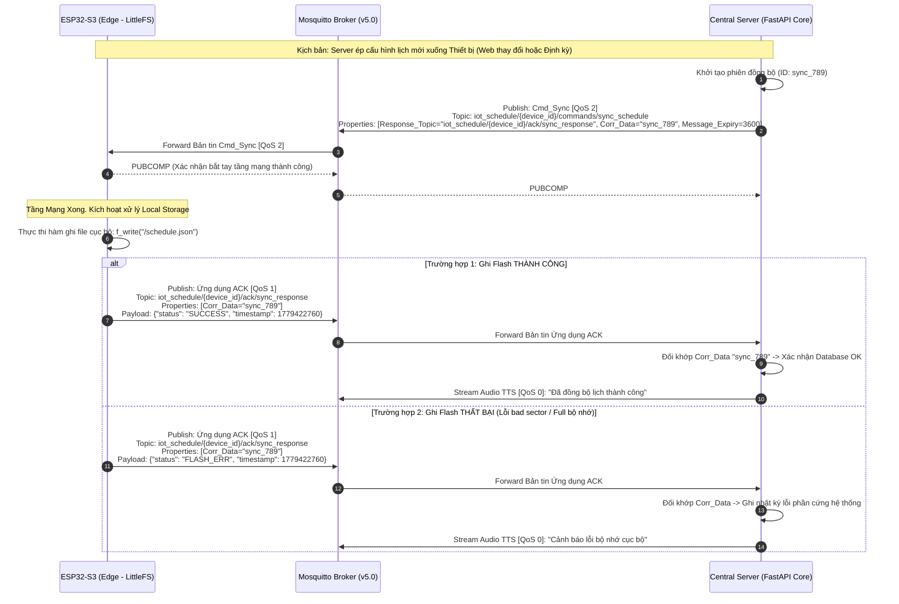
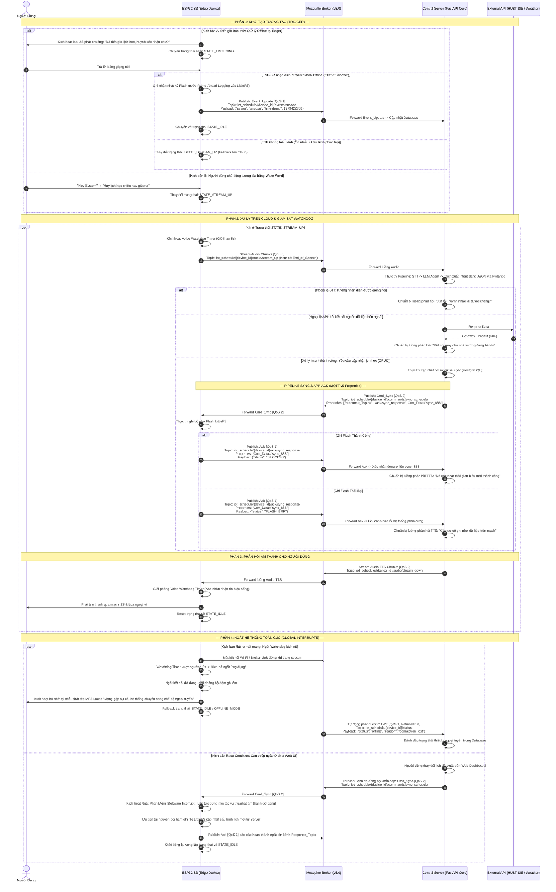
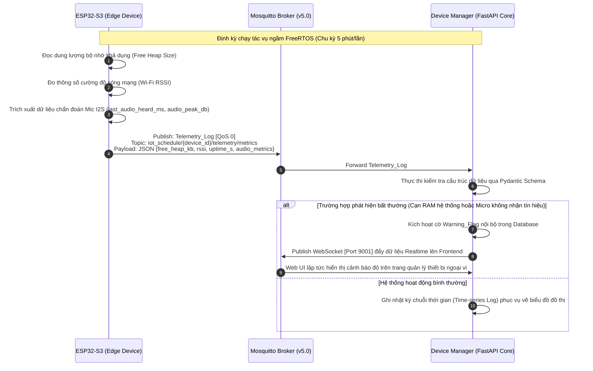

#Đồng bộ lịch

```mermaid
sequenceDiagram
    autonumber
    participant ESP as ESP32-S3 (Edge - LittleFS)
    participant Broker as Mosquitto Broker (v5.0)
    participant Server as Central Server (FastAPI Core)

    note over Server, ESP: Kịch bản: Server ép cấu hình lịch mới xuống Thiết bị (Web thay đổi hoặc Định kỳ)
    Server->>Server: Khởi tạo phiên đồng bộ (ID: sync_789)
    
    Server->>Broker: Publish: Cmd_Sync [QoS 2]<br/>Topic: iot_schedule/{device_id}/commands/sync_schedule<br/>Properties: [Response_Topic="iot_schedule/{device_id}/ack/sync_response", Corr_Data="sync_789", Message_Expiry=3600]
    Broker->>ESP: Forward Bản tin Cmd_Sync [QoS 2]
    ESP-->>Broker: PUBCOMP (Xác nhận bắt tay tầng mạng thành công)
    Broker-->>Server: PUBCOMP
    
    note over ESP: Tầng Mạng Xong. Kích hoạt xử lý Local Storage
    ESP->>ESP: Thực thi hàm ghi file cục bộ: f_write("/schedule.json")
    
    alt Trường hợp 1: Ghi Flash THÀNH CÔNG
        ESP->>Broker: Publish: Ứng dụng ACK [QoS 1]<br/>Topic: iot_schedule/{device_id}/ack/sync_response<br/>Properties: [Corr_Data="sync_789"]<br/>Payload: {"status": "SUCCESS", "timestamp": 1779422760}
        Broker->>Server: Forward Bản tin Ứng dụng ACK
        Server->>Server: Đối khớp Corr_Data "sync_789" -> Xác nhận Database OK
        Server->>Broker: Stream Audio TTS [QoS 0]: "Đã đồng bộ lịch thành công"
    else Trường hợp 2: Ghi Flash THẤT BẠI (Lỗi bad sector / Full bộ nhớ)
        ESP->>Broker: Publish: Ứng dụng ACK [QoS 1]<br/>Topic: iot_schedule/{device_id}/ack/sync_response<br/>Properties: [Corr_Data="sync_789"]<br/>Payload: {"status": "FLASH_ERR", "timestamp": 1779422760}
        Broker->>Server: Forward Bản tin Ứng dụng ACK
        Server->>Server: Đối khớp Corr_Data -> Ghi nhật ký lỗi phần cứng hệ thống
        Server->>Broker: Stream Audio TTS [QoS 0]: "Cảnh báo lỗi bộ nhớ cục bộ"
    end
```

#Luồng hoạt động tổng thể

```mermaid
sequenceDiagram
    autonumber
    actor User as Người Dùng
    participant ESP as ESP32-S3 (Edge Device)
    participant Broker as Mosquitto Broker (v5.0)
    participant Server as Central Server (FastAPI Core)
    participant ExtAPI as External API (HUST SIS / Weather)

    note over User, ExtAPI: --- PHẦN 1: KHỞI TẠO TƯƠNG TÁC (TRIGGER) ---
    
    alt Kịch bản A: Đến giờ báo thức (Xử lý Offline tại Edge)
        ESP->>User: Kích hoạt loa I2S phát chuông: "Đã đến giờ lịch học, huynh xác nhận chứ?"
        ESP->>ESP: Chuyển trạng thái sang STATE_LISTENING
        User->>ESP: Trả lời bằng giọng nói
        
        alt ESP-SR nhận diện được từ khóa Offline ("OK" / "Snooze")
            ESP->>ESP: Ghi nhận nhật ký Flash trước (Write-Ahead Logging vào LittleFS)
            ESP->>Broker: Publish: Event_Update [QoS 1]<br/>Topic: iot_schedule/{device_id}/events/snooze<br/>Payload: {"action": "snooze", "timestamp": 1779422760}
            Broker->>Server: Forward Event_Update -> Cập nhật Database
            ESP->>ESP: Chuyển về trạng thái STATE_IDLE
        else ESP không hiểu lệnh (Ồn nhiễu / Câu lệnh phức tạp)
            ESP->>ESP: Thay đổi trạng thái: STATE_STREAM_UP (Fallback lên Cloud)
        end

    else Kịch bản B: Người dùng chủ động tương tác bằng Wake Word
        User->>ESP: "Hey System" -> "Hủy lịch học chiều nay giúp ta"
        ESP->>ESP: Thay đổi trạng thái: STATE_STREAM_UP
    end

    note over User, ExtAPI: --- PHẦN 2: XỬ LÝ TRÊN CLOUD & GIÁM SÁT WATCHDOG ---
    opt Khi ở Trạng thái STATE_STREAM_UP
        ESP->>ESP: Kích hoạt Voice Watchdog Timer (Giới hạn 5s)
        ESP->>Broker: Stream Audio Chunks [QoS 0]<br/>Topic: iot_schedule/{device_id}/audio/stream_up (Kèm cờ End_of_Speech)
        Broker->>Server: Forward luồng Audio
        Server->>Server: Thực thi Pipeline: STT -> LLM Agent -> Trích xuất intent dạng JSON via Pydantic

        alt Ngoại lệ STT: Không nhận diện được giọng nói
            Server->>Server: Chuẩn bị luồng phản hồi: "Xin lỗi, huynh nhắc lại được không?"
            
        else Ngoại lệ API: Lỗi kết nối nguồn dữ liệu bên ngoài
            Server->>ExtAPI: Request Data
            ExtAPI--xServer: Gateway Timeout (504)
            Server->>Server: Chuẩn bị luồng phản hồi: "Kết nối máy chủ nhà trường đang bảo trì"
            
        else Xử lý Intent thành công: Yêu cầu cập nhật lịch học (CRUD)
            Server->>Server: Thực thi cập nhật cơ sở dữ liệu gốc (PostgreSQL)
            
            note over ESP, Server: --- PIPELINE SYNC & APP-ACK (MQTT v5 Properties) ---
            Server->>Broker: Publish: Cmd_Sync [QoS 2]<br/>Topic: iot_schedule/{device_id}/commands/sync_schedule<br/>Properties: [Response_Topic=".../ack/sync_response", Corr_Data="sync_888"]
            Broker->>ESP: Forward Cmd_Sync [QoS 2]
            ESP->>ESP: Thực thi ghi bộ nhớ Flash LittleFS
            
            alt Ghi Flash Thành Công
                ESP->>Broker: Publish: Ack [QoS 1]<br/>Topic: iot_schedule/{device_id}/ack/sync_response<br/>Properties: [Corr_Data="sync_888"]<br/>Payload: {"status": "SUCCESS"}
                Broker->>Server: Forward Ack -> Xác nhận đóng phiên sync_888
                Server->>Server: Chuẩn bị luồng phản hồi TTS: "Đã cập nhật thời gian biểu mới thành công"
            else Ghi Flash Thất Bại
                ESP->>Broker: Publish: Ack [QoS 1]<br/>Topic: iot_schedule/{device_id}/ack/sync_response<br/>Properties: [Corr_Data="sync_888"]<br/>Payload: {"status": "FLASH_ERR"}
                Broker->>Server: Forward Ack -> Ghi cảnh báo lỗi hệ thống phần cứng
                Server->>Server: Chuẩn bị luồng phản hồi TTS: "Gặp sự cố ghi nhớ dữ liệu trên mạch"
            end
        end

        note over User, ExtAPI: --- PHẦN 3: PHẢN HỒI ÂM THANH CHO NGƯỜI DÙNG ---
        Server->>Broker: Stream Audio TTS Chunks [QoS 0]<br/>Topic: iot_schedule/{device_id}/audio/stream_down
        Broker->>ESP: Forward luồng Audio TTS
        ESP->>ESP: Giải phóng Voice Watchdog Timer (Xác nhận nhận tín hiệu sống)
        ESP->>User: Phát âm thanh qua mạch I2S & Loa ngoại vi
        ESP->>ESP: Reset trạng thái về STATE_IDLE
    end

    note over User, ExtAPI: --- PHẦN 4: NGẮT HỆ THỐNG TOÀN CỤC (GLOBAL INTERRUPTS) ---
    
    par Kịch bản Rủi ro mất mạng: Ngắt Watchdog kích nổ
        ESP-xBroker: Mất kết nối Wi-Fi / Broker chết đứng khi đang stream
        ESP->>ESP: Watchdog Timer vượt ngưỡng 5s -> Kích nổ ngắt ứng dụng!
        ESP->>ESP: Ngắt kết nối dở dang, giải phóng bộ đệm ghi âm
        ESP->>User: Kích hoạt bộ nhớ tại chỗ, phát tệp MP3 Local: "Mạng gặp sự cố, hệ thống chuyển sang chế độ ngoại tuyến"
        ESP->>ESP: Fallback trạng thái: STATE_IDLE / OFFLINE_MODE
        Broker->>Server: Tự động phát di chúc: LWT [QoS 1, Retain=True]<br/>Topic: iot_schedule/{device_id}/status<br/>Payload: {"status": "offline", "reason": "connection_lost"}
        Server->>Server: Đánh dấu trạng thái thiết bị ngoại tuyến trong Database
        
    and Kịch bản Race Condition: Can thiệp ngắt từ phía Web UI
        Server->>Server: Người dùng thay đổi lịch đột xuất trên Web Dashboard
        Server->>Broker: Publish Lệnh ép đồng bộ khẩn cấp: Cmd_Sync [QoS 2]<br/>Topic: iot_schedule/{device_id}/commands/sync_schedule
        Broker->>ESP: Forward Cmd_Sync [QoS 2]
        ESP->>ESP: Kích hoạt Ngắt Phần Mềm (Software Interrupt): Lập tức dừng mọi tác vụ thu/phát âm thanh dở dang!
        ESP->>ESP: Ưu tiên tài nguyên gọi hàm ghi file LittleFS cập nhật cấu hình lịch mới từ Server
        ESP->>Broker: Publish: Ack [QoS 1] báo cáo hoàn thành ngắt lên kênh Response_Topic
        ESP->>ESP: Khởi động lại vòng lặp trạng thái về STATE_IDLE
    end
```

# Luồng Giám sát sức khỏe thiết bị (Telemetry & Device Shadow)

```mermaid
sequenceDiagram
    autonumber
    participant ESP as ESP32-S3 (Edge Device)
    participant Broker as Mosquitto Broker (v5.0)
    participant Server as Device Manager (FastAPI Core)

    note over ESP, Server: Định kỳ chạy tác vụ ngầm FreeRTOS (Chu kỳ 5 phút/lần)
    
    ESP->>ESP: Đọc dung lượng bộ nhớ khả dụng (Free Heap Size)
    ESP->>ESP: Đo thông số cường độ sóng mạng (Wi-Fi RSSI)
    ESP->>ESP: Trích xuất dữ liệu chẩn đoán Mic I2S (last_audio_heard_ms, audio_peak_db)
    
    ESP->>Broker: Publish: Telemetry_Log [QoS 0]<br/>Topic: iot_schedule/{device_id}/telemetry/metrics<br/>Payload: JSON {free_heap_kb, rssi, uptime_s, audio_metrics}
    Broker->>Server: Forward Telemetry_Log
    
    Server->>Server: Thực thi kiểm tra cấu trúc dữ liệu qua Pydantic Schema
    
    alt Trường hợp phát hiện bất thường (Cạn RAM hệ thống hoặc Micro không nhận tín hiệu)
        Server->>Server: Kích hoạt cờ Warning_Flag nội bộ trong Database
        Server->>Broker: Publish WebSocket [Port 9001] đẩy dữ liệu Realtime lên Frontend
        Broker->>Server: Web UI lập tức hiển thị cảnh báo đỏ trên trang quản lý thiết bị ngoại vi
    else Hệ thống hoạt động bình thường
        Server->>Server: Ghi nhật ký chuỗi thời gian (Time-series Log) phục vụ vẽ biểu đồ đồ thị
    end
```
